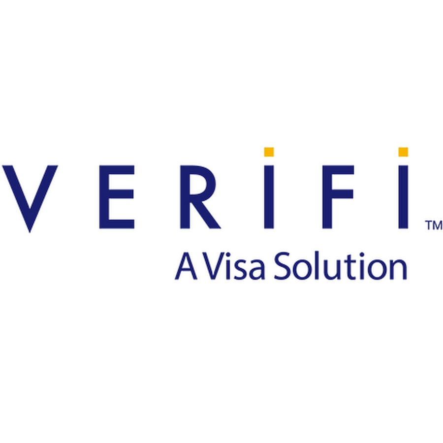

# Verifi, a Visa Solution

## Overview and Origin
---
* Verifi a Visa Solution
* Verifi a Visa Solution firm was founded in 2005, based in Los Angeles, California Jun 1, 2005
* Matthew Katz, Verifi’s founder and CEO
* The birth of Verifi came from CEO Katz while still attending college, started a successful business that helped him develop the “Casino Strategy” which lead him to obtain high-level strategic partnerships. With those partnerships it would then lead him on the develop a customized solution that systematically identifies multiple types of payment risk.
* Katz previous successful business help Verifi receive funding from investors such as Brightwood Capital Advisors and many others.

## Business Activities:
---
* Verifi has played a major part in Chargeback Solutions with a focus on developing merchant tools to help them manage and control their risk. They use many tools to allow merchants to take more control, have better understanding and visibility of their business. Providing the best softwares to allow merchants to process payments with their easy to use technology. Verifi’s has continued to focus on new products, innovation, new solutions and new technologies in the payments space.
* Verifi supports more than 13,000 accounts for merchants. Companies ranging from start-ups to fortune 500 enterprises to deliver the best e-commerce solutions. Ecommerce merchants or Omni-channel trust Verifi to maximize their profits. 
* •	Verifi solutions enables sellers to proactively resolve non-fraud and confirmed fraud disputes with a refund or cancellation. Using “Rapid Dispute Resolution” and “Cardholder Dispute Resolution Network”. RDR is which allows pre- disputes, auto- decision with participating RDR issuers using a vigorous decision engine tailored by sell for real time resolution. CDRN resolves pre-disputes guided by partaking CDRN issuers within 72 hours by seller-initiated refund 
* Verifi uses several application & Data, utilities, and business tool technologies such as: PHP, Nginx, Google Analytics, WordPress, Marketo, and Olark.

## Landscape
---
* Verifi’s main domain used is their primary product which is Cardholder Dispute Resolution Network (CDRN). This product helps connect financial organizations and merchants to act in real time to initiate traditional chargeback procedures, real time to issue refunds or to work to clear up equivocal transaction histories. 
* Over last 5 years chargebacks have escalated for merchants and issuers. Chargebacks were a $31 billion problem with $19 billon of the burden falling exclusively on merchants. 63% of consumers ceased merchant support after a dispute, which is not a defensible trend. This aspect has made it very stimulating for merchants to stay true to their route of success. 
* Verifi has quite a few immense rivals in their domain. Such companies that rival them revenue generate, data provided for merchants and companies, and staffing. To list a few which are:
Dun & Bradstreet,
Ethoca,
Accertify, and
Chargebacks 911

## Results
---
* Verfi’s vision has effectively help payments grow by creating new technologies that allow for merchants to have a better understanding of what is trendy in their business through an analytic base method and by adding up to 2,000 additional data points outside your standard customer information so Verifi could create more advanced solutions and then leverage a very adaptable decision engine to take action. 
* Today Verifi is branched into a number of directions. They have focused their concepts on risk. The tools they have built to increase the lifetime value of their customer relationships.

## Recommendations
---
* After studying customer habits I would recommend Verifi to create several omnichannels to help better serve their products to merchants. Customers who do online research of both competitors and merchant s spend 13% more than those online visiting in-store.  Companies who have four or more channels spent on average 9% more in-store, compared to customers who used only one channel. With such channels it will help better eliminate chargebacks, stolen merchandise, recourse and time costs, and brand reputation. These cannot be ignored especially around the holiday sale season. For merchants who have been burned with card fraud, these channels can help decline the dishonest customers

## Resources
---
https://www.verifi.com/company-chargebacks-and-payment-protection-for-cnp-merchants/management-team-partners/
https://www.pymnts.com/news/retail/2016/verifi-order-insight-merchant-communication/
https://finance.yahoo.com/news/merchants-hit-chargebacks-look-hire-120000472.html
https://www.owler.com/company/verifi
https://www.cbinsights.com/company/verifi-inc-jobs
https://tearsheet.co/payments/30-experts-weigh-in-on-the-future-of-payments/
https://stackshare.io/verifi/verifi
